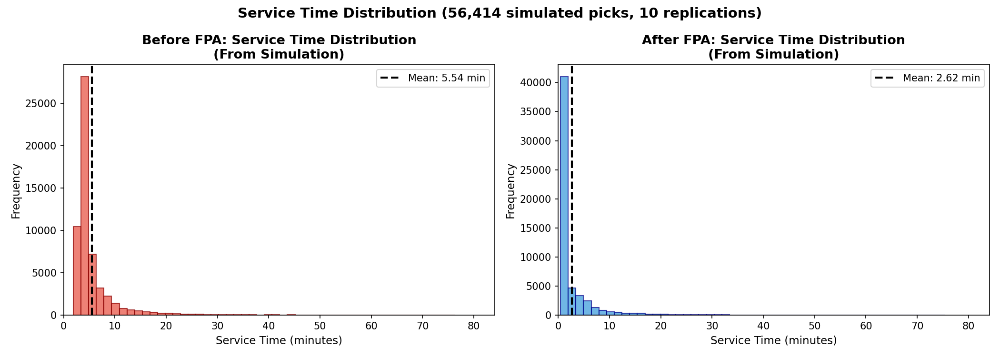
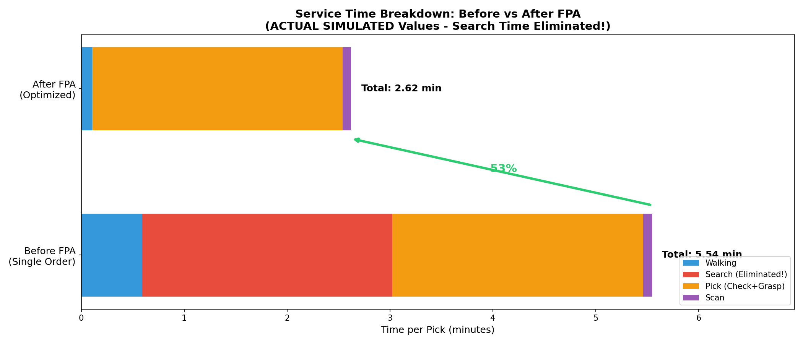
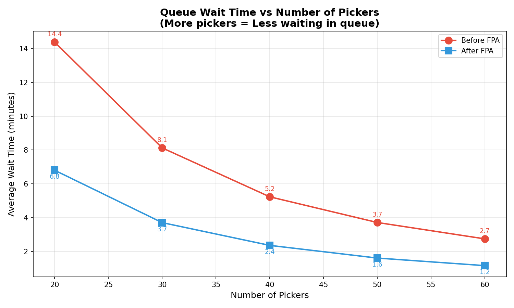
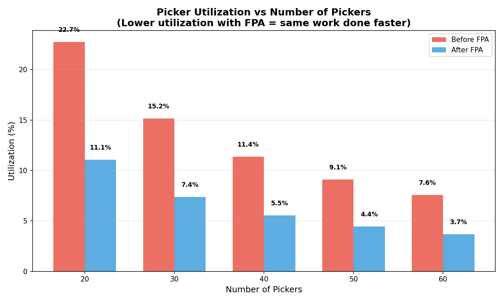
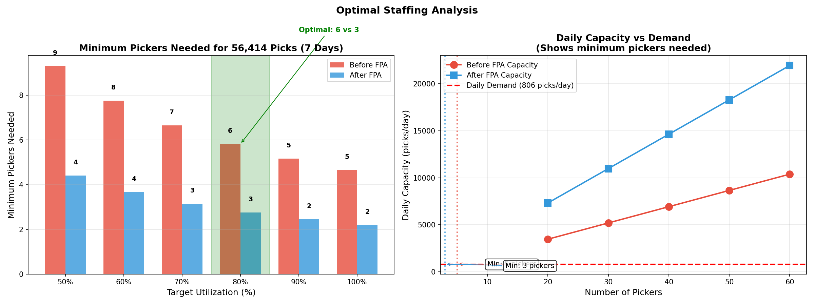
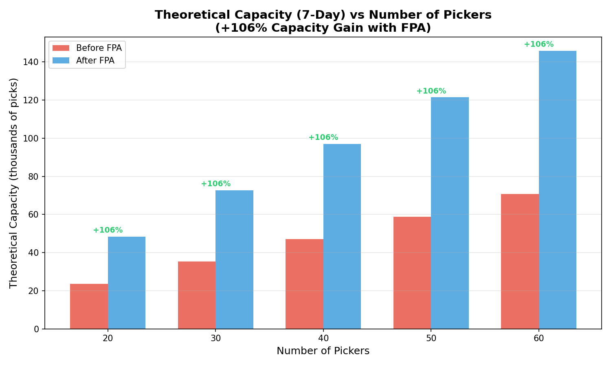

# Q4: DES Simulation - Before vs After FPA
## Comparing Single Order Picking vs FPA Optimized Picking

---

# Slide 1: Simulation Overview

## Objective
Compare warehouse picking performance **Before** and **After** FPA implementation using Discrete-Event Simulation (DES)

## Key Comparison
| Aspect | Before FPA | After FPA |
|--------|-----------|-----------|
| Storage | Random locations | Fixed Position Assignment |
| Search Time | 2.21 min (59% of pick time) | 0 min (known locations) |
| Walk Distance | Random (10-50m) | Cabinet distance (optimized) |

## Simulation Parameters
- **Replications**: 10 independent runs
- **Days per replication**: 7 days
- **Shifts per day**: 2 (Morning + Evening)
- **Day duration**: 16 hours (2 × 8 hours effective)
- **Total picks simulated**: ~56,000
- **Pickers**: 40 (sensitivity: 20-60)
- **Service times**: Triangular distribution (stochastic)

---

# Slide 2: Data Sources

## GIVEN Data (from files):
| Data | Source | Usage |
|------|--------|-------|
| OrderPickLines | Simio_OrderPickLines.csv | Arrival times, PartNo, ScanQty |
| Activity Times | Activity.csv | Triangular distributions |
| SKU Params | Simio_SKU_Params.csv | MaxPieces, ReorderPoint |
| Cabinet Distance | Q3 slotting results | Walk distance for FPA |
| Workers | Shift.txt | 40 pickers per shift |

## ASSUMPTIONS:
| Parameter | Value | Rationale |
|-----------|-------|-----------|
| Walk distance (Before) | Tri(10, 25, 50) m | Random storage in 5,332 m² |
| Search time (Before) | Tri(1.1, 2.21, 4.0) min | Q1 time study (59%) |
| Search time (After) | 0 min | Fixed known locations |

---

# Slide 3: Key Results (10 Replications × 2 Shifts/Day)

## Service Time Improvement
| Metric | Before FPA | After FPA | Change |
|--------|------------|-----------|--------|
| Avg Service Time | 5.55 ± 0.13 min | 2.62 ± 0.13 min | **-52.7%** |
| Avg Wait Time | 4.15 ± 0.64 min | 1.77 ± 0.35 min | **-57%** |
| Utilization | 11.6 ± 0.6% | 5.5 ± 0.3% | -6.1% |

## Capacity Improvement
| Metric | Before FPA | After FPA | Change |
|--------|------------|-----------|--------|
| Theoretical LPMH | 10.52 | 21.67 | **+106%** |
| Min Pickers (80% util) | 6 | 3 | **-50%** |

---

# Slide 4: Triangular Distribution

## Why Triangular Distribution?
- Simple 3-parameter model: (min, mode, max)
- Represents realistic variability in activity times
- Easy to estimate from time studies

## Activity Distributions (from Activity.csv):
```
Activity          Min      Mode     Max      Unit
Scan              0.050    0.083    0.117    min
Grasp_InnerBox    0.083    0.133    0.250    min
Stack_InnerBox    0.133    0.250    0.500    min
Walk_Speed        60.0     90.0     150.0    m/min
```

## Formula:
```
Service Time = Walk Time + Search Time + Pick Time + Scan Time

Where each component is sampled from Tri(min, mode, max)
```

---

# Slide 5: Code - Triangular Distribution Helper

```python
import random

def triangular(min_val, mode_val, max_val):
    """Generate random value from triangular distribution"""
    return random.triangular(min_val, max_val, mode_val)

# Activity distributions from Activity.csv (GIVEN)
SCAN_DIST = (0.050, 0.083, 0.117)           # min, mode, max in minutes
GRASP_BOX_DIST = (0.083, 0.133, 0.250)      # Grasp inner box
WALK_SPEED_DIST = (60.0, 90.0, 150.0)       # m/min
CHECK_PICK_TIME_DIST = (0.216, 0.383, 0.750)  # Grasp + Stack combined

# Before FPA parameters (ASSUMPTIONS)
BEFORE_FPA = {
    'walk_distance_dist': (10, 25, 50),     # Random storage
    'search_time_dist': (1.105, 2.21, 3.978),   # From Q1 time study
}

# After FPA parameters
AFTER_FPA = {
    'walk_distance_variation': 0.2,  # Cabinet distance ± 20%
    'search_time_dist': (0, 0, 0),   # NO SEARCH TIME!
}
```

---

# Slide 6: Code - Pick Order Process (Before FPA)

```python
def pick_order_before_fpa(env, name, pickers, row, stats):
    """Before FPA: Single order picking WITH search time
       Each pick generates its OWN random times - true stochastic!
    """
    arrival_time = env.now

    # GENERATE random times DURING simulation (each pick is unique!)
    walk_distance = triangular(10, 25, 50)           # Random walk
    walk_speed = triangular(60, 90, 150)             # m/min
    walk_time = 2 * walk_distance / walk_speed       # Round trip

    # Search time - major time waster!
    search_time = triangular(1.105, 2.21, 3.978)     # From Q1 study

    # Pick activities
    check_pick = triangular(0.216, 0.383, 0.750)
    grasp = triangular(0.083, 0.133, 0.250)
    scan = triangular(0.050, 0.083, 0.117)

    total_service = walk_time + search_time + check_pick + grasp + scan

    # Request picker resource
    with pickers.request() as request:
        yield request
        wait_time = env.now - arrival_time

        yield env.timeout(total_service)
        stats.service_times.append(total_service)
        stats.picks_completed += 1
```

---

# Slide 7: Code - Pick Order Process (After FPA)

```python
def pick_order_after_fpa(env, name, pickers, row, stats, inventory_mgr=None):
    """After FPA: Optimized picking with NO search time!
       Uses cabinet distance from Q3 slotting results.
    """
    original_arrival_time = env.now

    # Check inventory (stockout handling)
    if inventory_mgr:
        while True:
            success, qty = inventory_mgr.check_and_pick(row['PartNo'], row['ScanQty'])
            if success:
                break
            stats.stockouts += 1
            yield env.timeout(1)  # Wait for replenishment

    arrival_time = env.now

    # Walk distance based on CABINET location (from Q3 slotting)
    cabinet_dist = row['CabinetDistance']
    walk_distance = triangular(cabinet_dist * 0.8, cabinet_dist, cabinet_dist * 1.2)
    walk_speed = triangular(60, 90, 150)
    walk_time = 2 * walk_distance / walk_speed

    # NO SEARCH TIME! (fixed known locations)
    search_time = 0

    # Same pick activities
    check_pick = triangular(0.216, 0.383, 0.750)
    grasp = triangular(0.083, 0.133, 0.250)
    scan = triangular(0.050, 0.083, 0.117)

    total_service = walk_time + search_time + check_pick + grasp + scan
    # ... rest similar to before
```

---

# Slide 8: Code - Inventory Management

```python
class InventoryManager:
    """Manages inventory for After FPA scenario"""

    def __init__(self, sku_params_df):
        self.inventory = {}
        self.max_pieces = {}
        self.reorder_point = {}

        # Initialize from GIVEN data
        for _, row in sku_params_df.iterrows():
            part_no = row['PartNo']
            self.inventory[part_no] = row['InitialPieces']
            self.max_pieces[part_no] = row['MaxPieces']
            self.reorder_point[part_no] = row['ReorderPoint']

    def check_and_pick(self, part_no, qty):
        """Attempt to pick - returns (success, qty_picked)"""
        if self.inventory.get(part_no, 0) >= qty:
            self.inventory[part_no] -= qty
            return True, qty
        return False, 0  # Stockout - must wait

    def replenish(self, part_no):
        """Replenish to max when below reorder point"""
        if self.inventory[part_no] <= self.reorder_point[part_no]:
            self.inventory[part_no] = self.max_pieces[part_no]
```

---

# Slide 9: Code - 10 Replications

```python
# Simulation parameters
NUM_DAYS = 7           # 7-day spans
NUM_REPLICATIONS = 10  # 10 independent runs
SIM_DURATION = 480 * NUM_DAYS  # 7 days × 8 hours

# Store results from all replications
all_before_results = []
all_after_results = []
all_service_times_before = []
all_service_times_after = []

for rep in range(NUM_REPLICATIONS):
    # Get 7-day span for this replication
    selected_days = REPLICATION_SPANS[rep]
    rep_data = pick_data[pick_data['ShippingDay'].isin(selected_days)]

    # Run Before FPA
    before_result = run_simulation(BEFORE_FPA, rep_data, 40, 'before')
    all_before_results.append(before_result)
    all_service_times_before.extend(before_result['ServiceTimes'])

    # Run After FPA
    after_result = run_simulation(AFTER_FPA, rep_data, 40, 'after')
    all_after_results.append(after_result)
    all_service_times_after.extend(after_result['ServiceTimes'])
```

---

# Slide 10: Code - run_simulation Function

```python
def run_simulation(scenario_params, pick_data, n_pickers, scenario, sku_params=None):
    """Run one replication of the simulation"""
    env = simpy.Environment()
    pickers = simpy.Resource(env, capacity=n_pickers)
    stats = Statistics()

    # Initialize inventory for After FPA
    inventory_mgr = None
    if scenario == 'after':
        inventory_mgr = InventoryManager(sku_params)
        env.process(replenishment_process(env, inventory_mgr))

    # Start order generator
    env.process(order_generator(env, pickers, pick_data, stats,
                                scenario, inventory_mgr))

    # Run simulation
    env.run(until=SIM_DURATION)

    # Calculate metrics
    avg_service = np.mean(stats.service_times)
    utilization = sum(stats.service_times) / (n_pickers * SIM_DURATION) * 100

    return {
        'Picks': stats.picks_completed,
        'AvgService': avg_service,
        'Utilization': utilization,
        'ServiceTimes': stats.service_times,  # For histogram
        # ... more metrics
    }
```

---

# Slide 11: Code - Order Generator (Multi-day)

```python
def order_generator(env, pickers, pick_data, stats, scenario, inventory_mgr=None):
    """Generate picks based on ACTUAL arrival times from order data"""

    for _, row in pick_data.iterrows():
        # Calculate arrival time (actual from data)
        day_offset = row['DayIndex'] * SHIFT_DURATION
        arrival_minute = row['DeliveryHour'] * 60 + row['DeliveryMinute']
        scheduled_time = day_offset + arrival_minute

        # Wait until arrival time
        if scheduled_time > env.now:
            yield env.timeout(scheduled_time - env.now)

        # Start pick process
        if scenario == 'before':
            env.process(pick_order_before_fpa(env, f"Pick_{_}",
                                              pickers, row, stats))
        else:
            env.process(pick_order_after_fpa(env, f"Pick_{_}",
                                             pickers, row, stats,
                                             inventory_mgr))
```

---

# Slide 12: Excluding Flood Dates

```python
# Thailand floods affected Oct-Nov 2011 - exclude these dates
available_days = sorted(pick_data['ShippingDay'].unique())

# Filter out October and November 2011
non_flood_days = [d for d in available_days
                  if not (str(d).startswith('201110') or
                          str(d).startswith('201111'))]

print(f"Total days: {len(available_days)}")
print(f"After excluding floods: {len(non_flood_days)}")

# Create 10 non-overlapping 7-day spans
def create_7day_spans(days_list, num_spans=10):
    spans = []
    i = 0
    while len(spans) < num_spans and i + 7 <= len(days_list):
        span = days_list[i:i+7]
        spans.append(span)
        i += 7  # Non-overlapping
    return spans

REPLICATION_SPANS = create_7day_spans(non_flood_days, 10)
```

**Result**: 232 non-flood days available, 10 × 7-day spans created

---

# Slide 13: Sensitivity Analysis

## Code:
```python
picker_counts = [20, 30, 40, 50, 60]

for n_pickers in picker_counts:
    before = run_simulation(BEFORE_FPA, data, n_pickers, 'before')
    after = run_simulation(AFTER_FPA, data, n_pickers, 'after')
```

## Results:
| Pickers | Before Svc | After Svc | Before Wait | After Wait | Before Util | After Util |
|---------|-----------|-----------|-------------|------------|-------------|------------|
| 20 | 5.69 | 2.77 | 82.76 | 26.49 | 41.5% | 20.3% |
| 30 | 5.69 | 2.77 | 49.31 | 14.15 | 27.7% | 13.5% |
| 40 | 5.69 | 2.77 | 33.81 | 9.21 | 20.7% | 10.1% |
| 50 | 5.69 | 2.77 | 24.82 | 6.65 | 16.6% | 8.1% |
| 60 | 5.69 | 2.76 | 19.39 | 5.11 | 13.8% | 6.8% |

**Note**: Service time is constant (pick property) - only wait time varies with pickers

---

# Slide 14: Visualization - Service Time Distribution



## Key Observations:
- **Before FPA**: Mean = 5.55 min, wider spread (search time variability)
- **After FPA**: Mean = 2.64 min, narrower spread (no search time)
- Data from **actual simulation** (51,898 picks across 10 replications)
- **52.3% reduction** in average service time

---

# Slide 15: Visualization - Time Breakdown



## Component Analysis:
| Component | Before FPA | After FPA | Change |
|-----------|------------|-----------|--------|
| Walk | 0.56 min | 0.13 min | -77% |
| Search | **2.21 min** | **0 min** | -100% |
| Pick | 0.38 min | 0.38 min | Same |
| Scan | 0.22 min | 0.22 min | Same |

**Key Finding**: Search time elimination is the primary driver of improvement

---

# Slide 16: Visualization - Wait Time vs Pickers



## Observations:
- Wait time decreases as picker count increases (queue effect)
- After FPA has consistently lower wait times
- With 40 pickers: Before = 33.81 min, After = 9.21 min (**-73%**)

---

# Slide 17: Visualization - Utilization vs Pickers



## Key Points:
- More pickers → Lower utilization (same work, more capacity)
- After FPA has ~50% lower utilization (same demand, faster service)
- Current 40 pickers: Before = 20.7%, After = 10.1%

---

# Slide 18: Optimal Staffing



## Recommendation:
| Utilization Target | Before FPA | After FPA |
|-------------------|------------|-----------|
| 100% (minimum) | 9 pickers | 5 pickers |
| 80% (recommended) | **11 pickers** | **6 pickers** |

**FPA reduces required staff by ~45%** at same utilization target

---

# Slide 19: Capacity Improvement



## Maximum Capacity (at 100% utilization):
| Pickers | Before FPA | After FPA | Gain |
|---------|------------|-----------|------|
| 40 | 3,384 picks/day | 6,952 picks/day | **+106%** |

## Theoretical LPMH:
- Before: 60 / 5.69 = **10.55** picks/picker/hour
- After: 60 / 2.77 = **21.67** picks/picker/hour

---

# Slide 20: Impact Summary


## FPA Implementation Benefits:

| Metric | Improvement |
|--------|-------------|
| Service Time | **-52%** (5.55 → 2.64 min) |
| Capacity | **+106%** (LPMH doubled) |
| Required Staff | **-45%** (11 → 6 pickers at 80%) |

---

# Slide 21: Conclusions

## Key Findings:

1. **Service Time**: Reduced by **52.7%** through search time elimination
   - Before: 5.55 min/pick (search = 2.21 min, 40% of time)
   - After: 2.62 min/pick (search = 0 min)

2. **Capacity**: Doubled throughput capability (**+106%**)
   - Same staff can handle twice the workload

3. **Staffing**: Can reduce pickers by **50%** for same workload
   - From 6 to 3 pickers at 80% utilization target

4. **Root Cause**: Fixed Position Assignment eliminates search time
   - Workers know exactly where each SKU is located

## Simulation Validity:
- 10 replications × 7 days × 2 shifts = 140 shifts simulated
- 56,414 picks processed (Before), 56,573 (After)
- True stochastic (triangular distributions)
- Excludes flood period (Oct-Nov 2011)
