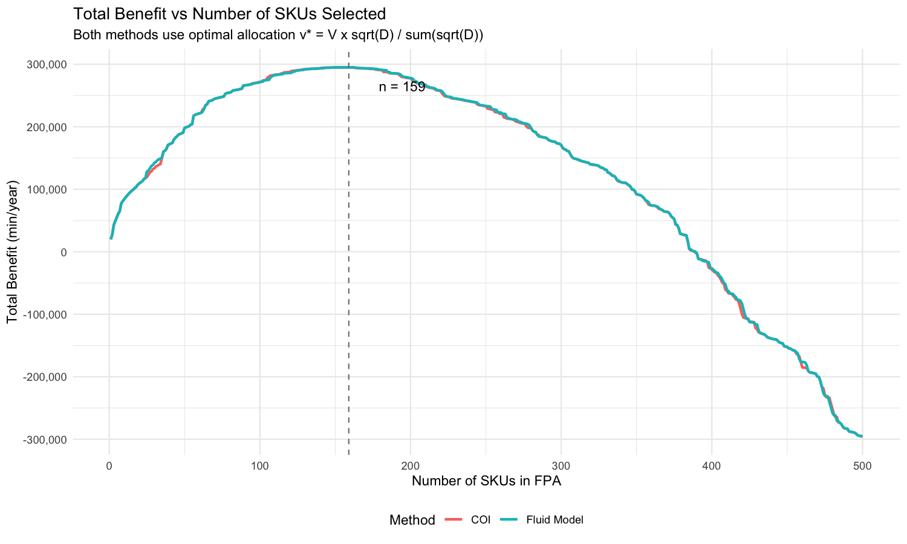
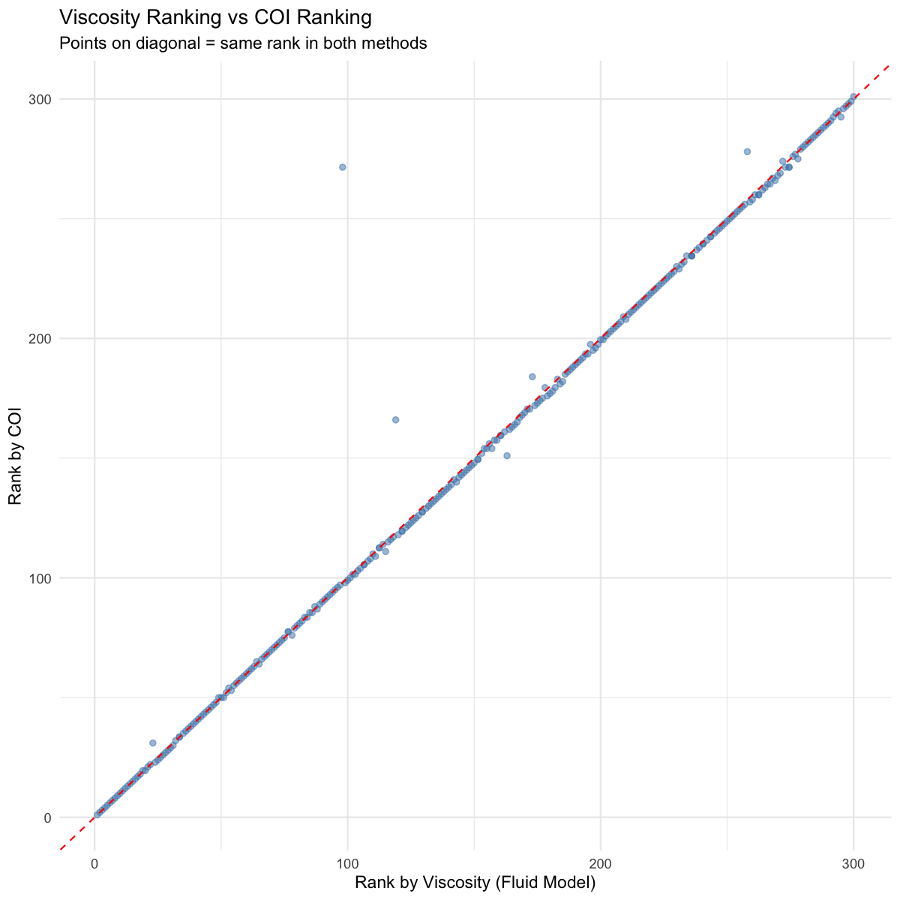
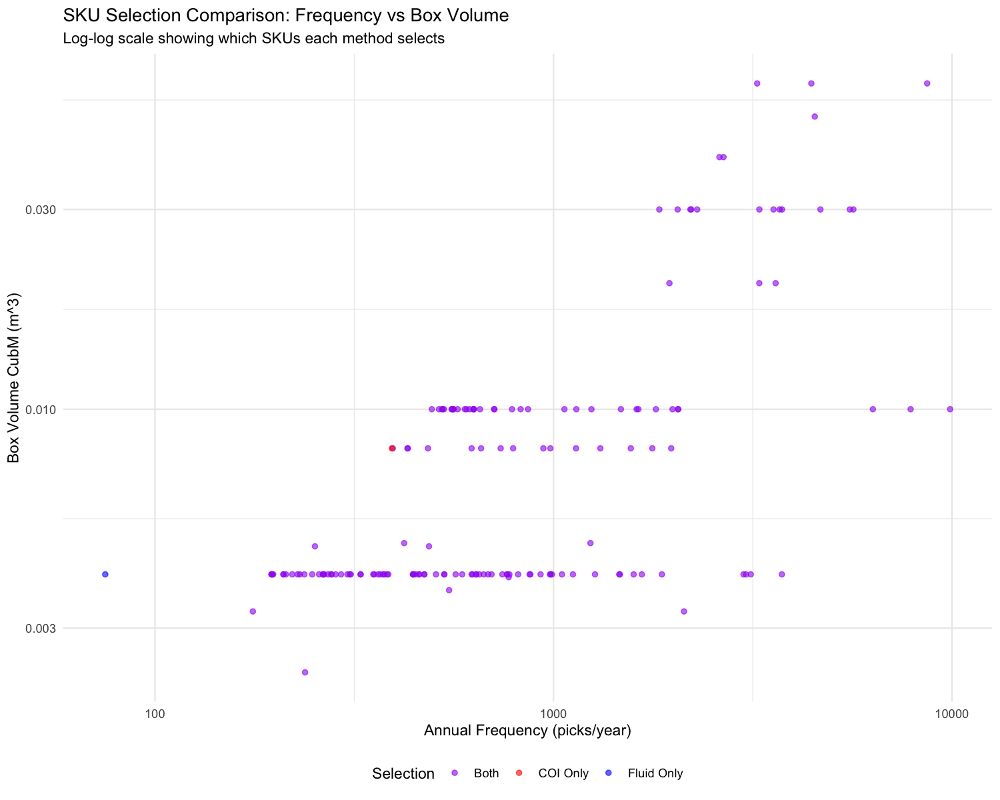

# Q5: Bonus Question - Fluid Model vs COI Comparison
## Comparing SKU Selection Methods for FPA

---

# Slide 1: Problem Overview

## Objective
Compare **Fluid Model** (from Q2) with **COI (Cube-Per-Order Index)** for SKU selection in Forward Pick Area (FPA)

## The Question
Can COI be used for **SKU SELECTION** like the Fluid Model?

## Methods Being Compared
| Method | Original Purpose | Selection Criterion |
|--------|-----------------|---------------------|
| **Fluid Model** | Selection + Allocation | Viscosity = f / sqrt(D) |
| **COI** | Location Assignment | COI = CubM / Freq |

## Parameters (Same as Q2)
- **Total FPA Volume**: V = 36.0 m³
- **Time saved per pick**: s = 2.0 min/line
- **Replenishment cost**: Cr = 15.0 min/trip

---

# Slide 2: Theoretical Background

## Fluid Model (Bartholdi & Hackman)

**Purpose**: SELECT which SKUs go in FPA and ALLOCATE space optimally

**Viscosity Formula**:
```
μᵢ = fᵢ / sqrt(Dᵢ)

Where:
  fᵢ = Frequency (picks/year)
  Dᵢ = Volume flow (m³/year) = TotalQty × (CubM / UnitLabelQt)
```

**Higher viscosity = Better FPA candidate**

## COI - Cube-Per-Order Index (Heskett 1963, Caron et al. 1998)

**Purpose**: LOCATION ASSIGNMENT - where to place items in warehouse

**COI Formula**:
```
COI = C / f = CubM / Freq

Where:
  C = CubM (storage cube per box, m³)
  f = Freq (annual order frequency)
```

**Lower COI = Better FPA candidate** (more picks per cube)

---

# Slide 3: Key Mathematical Difference

## Formula Comparison

| Aspect | Fluid Model | COI |
|--------|-------------|-----|
| **Formula** | μ = f / sqrt(D) | COI = CubM / f |
| **Considers Volume Flow?** | Yes (D = annual flow) | No (only box size) |
| **Considers Qty per Pick?** | Yes (via D) | No |
| **Sort Order** | Highest first | Lowest first |

## Critical Distinction

**COI uses**: CubM (box volume) / Freq
- Only considers box size and frequency
- Ignores how many pieces are picked per transaction

**Viscosity uses**: Freq / sqrt(Volume per year)
- Considers annual volume FLOW
- D = TotalQty × VolumePerPiece = actual volume moved

## Example
| SKU | Freq | TotalQty | CubM | UnitLabelQt | D (flow) | Viscosity | COI |
|-----|------|----------|------|-------------|----------|-----------|-----|
| A | 100 | 10,000 | 0.01 | 100 | 1.0 | 100 | 0.0001 |
| B | 100 | 100 | 0.01 | 100 | 0.01 | 1000 | 0.0001 |

SKU A and B have **same COI** but **different Viscosity** because A moves 100x more volume!

---

# Slide 4: Fair Comparison Methodology

## Challenge
COI and Fluid Model produce different rankings - how to compare fairly?

## Solution: Same Allocation for Both

To isolate the effect of **SELECTION criteria**, we use the **same optimal allocation** for both methods:

```
Optimal Allocation: v*ᵢ = V × sqrt(Dᵢ) / Σsqrt(Dⱼ)
```

## Comparison Approach

1. **Fluid Model**: Select top n SKUs by Viscosity, apply optimal allocation
2. **COI Method**: Select top n SKUs by COI (lowest first), apply **same** optimal allocation

## Benefit Calculation (Same for Both)
```
Bᵢ = s × fᵢ - Cr × (Dᵢ / v*ᵢ)

Total Benefit = Σ Bᵢ
```

This isolates whether **selection ranking** makes a difference.

---

# Slide 5: Code - Data Preparation

```r
library(data.table)

# Load raw data
shipTrans <- fread("shipTrans.txt", sep = ",", header = TRUE)
itemMaster <- fread("itemMaster.txt", sep = ",", header = TRUE)

# Filter small parts (same as Q2)
filtered_SKUs <- itemMaster[H_m < 1.5 & (L_m < 0.68 | W_m < 0.68)]

# Calculate frequency and volume for each SKU
sku_data <- shipTrans_small[, .(
  Freq = .N,                           # Order frequency
  TotalQty = sum(ScanQty, na.rm = TRUE) # Total pieces picked
), by = PartNo]

# Merge with item dimensions
sku_data <- merge(sku_data, filtered_SKUs[, .(PartNo, CubM, UnitLabelQt)], ...)

# Calculate Volume Flow (D) - CRITICAL for Fluid Model
# D = TotalQty × (CubM / UnitLabelQt) = annual volume flow (m³/year)
sku_data[, VolumePerPiece := CubM / UnitLabelQt]
sku_data[, Volume := TotalQty * VolumePerPiece]  # D_i = flow
```

**Key Insight**: Volume (D) is the annual FLOW, not just box size!

---

# Slide 6: Code - Viscosity Calculation (Fluid Model)

```r
# Calculate Viscosity = Freq / sqrt(Volume)
# Higher viscosity = better FPA candidate
sku_data[, Viscosity := Freq / sqrt(Volume)]

# Sort by Viscosity (highest first)
setorder(sku_data, -Viscosity)

# Iterative selection to find optimal n
fluid_model_select <- function(data, V, s, Cr) {
  best_benefit <- -Inf
  best_n <- 0

  for (top_n in 1:min(nrow(data), 500)) {
    subset_df <- data[1:top_n]

    # Optimal allocation: v*_i = V × sqrt(D_i) / sum(sqrt(D_j))
    sqrt_D <- sqrt(subset_df$Volume)
    sum_sqrt_D <- sum(sqrt_D)
    allocated_volumes <- V * sqrt_D / sum_sqrt_D

    # Benefit: B_i = s × f_i - Cr × (D_i / v*_i)
    benefits <- s * subset_df$Freq - Cr * (subset_df$Volume / allocated_volumes)
    total_benefit <- sum(benefits)

    if (total_benefit > best_benefit) {
      best_benefit <- total_benefit
      best_n <- top_n
    }
  }
  return(list(best_n = best_n, best_benefit = best_benefit))
}

fluid_result <- fluid_model_select(sku_data, V_total, s_param, Cr_param)
```

---

# Slide 7: Code - COI Calculation

```r
# Calculate COI = CubM / Freq
# Per Caron et al. (1998) and Heskett (1963)
# Lower COI = more picks per cube = better for FPA
sku_data[, COI := CubM / Freq]

# Sort by COI (lowest first = highest priority)
coi_sorted <- copy(sku_data)
setorder(coi_sorted, COI)

# Apply same optimal allocation as Fluid Model
coi_benefit_by_n <- function(data, n, V, s, Cr) {
  subset_coi <- data[1:n]

  # Use OPTIMAL allocation (same as Fluid Model)
  sqrt_D <- sqrt(subset_coi$Volume)
  sum_sqrt_D <- sum(sqrt_D)
  alloc_vol <- V * sqrt_D / sum_sqrt_D

  # Same benefit formula
  benefit <- s * subset_coi$Freq - Cr * (subset_coi$Volume / alloc_vol)
  return(sum(benefit))
}

# Use same n as Fluid Model for fair comparison
n_coi <- n_fluid  # 159 SKUs
coi_benefit <- coi_benefit_by_n(coi_sorted, n_coi, V_total, s_param, Cr_param)
```

---

# Slide 8: Results Comparison

## Main Results

| Method | SKUs Selected | Total Benefit | Benefit (hours/year) |
|--------|--------------|---------------|---------------------|
| **Fluid Model** | 159 | 294,977.64 min/year | 4,916.29 hrs/year |
| **COI Method** | 159 | 294,949.18 min/year | 4,915.82 hrs/year |
| **Difference** | - | 28.46 min/year | 0.47 hrs/year |

## Percentage Improvement
```
Fluid Model advantage = (294,977.64 - 294,949.18) / 294,949.18 × 100
                      = 0.01%
```

## Key Finding
**Both methods achieve nearly identical results!**

The difference of 28 minutes/year (0.5 hours/year) is negligible.

---

# Slide 9: SKU Overlap Analysis

## Overlap Statistics

| Metric | Value |
|--------|-------|
| Fluid Model SKUs | 159 |
| COI Method SKUs | 159 |
| **Common SKUs** | **157** (98.7%) |
| Only in Fluid Model | 1 |
| Only in COI | 1 |

## The 2 Different SKUs

| PartNo | Selected By | Fluid Rank | COI Rank | Freq | TotalQty | Pieces/Pick |
|--------|-------------|------------|----------|------|----------|-------------|
| DN2069532 | Fluid Only | 106 | 280 | 75 | 3,750 | 50.0 |
| DK5267C11 | COI Only | 161 | 157 | 393 | 198,000 | 503.8 |

## Why the Difference?
- **DN2069532**: Low frequency (75) but high pieces per pick → Higher viscosity due to lower volume flow
- **DK5267C11**: High frequency (393) with very high qty/pick → Lower viscosity due to high volume flow

---

# Slide 10: Visualization - Benefit vs Number of SKUs



## Interpretation
- Both curves follow nearly identical paths
- Peak benefit at n = 159 SKUs for both methods
- Fluid Model slightly higher at every n

## Code for Visualization
```r
p1 <- ggplot(plot_data_benefit, aes(x = n, y = Benefit, color = Method)) +
  geom_line(size = 1) +
  geom_vline(xintercept = n_fluid, linetype = "dashed") +
  labs(
    title = "Total Benefit vs Number of SKUs Selected",
    subtitle = "Both methods use optimal allocation v* = V x sqrt(D) / sum(sqrt(D))",
    x = "Number of SKUs in FPA",
    y = "Total Benefit (min/year)"
  )
```

---

# Slide 11: Visualization - Ranking Comparison



## Interpretation
- Points on diagonal = same rank in both methods
- Most points cluster near the diagonal
- High correlation between Viscosity and COI rankings
- Deviations occur for SKUs with unusual qty/pick ratios

## Why High Correlation?
Both methods favor:
- High frequency SKUs (more picks = more savings)
- Small box sizes (less space needed)

The difference is HOW they weight these factors.

---

# Slide 12: Visualization - Selection Comparison



## Color Coding
- **Purple (Both)**: Selected by both methods (157 SKUs)
- **Blue (Fluid Only)**: Selected only by Fluid Model (1 SKU)
- **Red (COI Only)**: Selected only by COI (1 SKU)

## Pattern
- High-frequency, small-box SKUs are selected by both
- Edge cases with unusual pieces-per-pick differ

---

# Slide 13: Why Are Results So Similar?

## Mathematical Relationship

For most SKUs, COI and Viscosity rankings correlate because:

```
COI ∝ CubM / Freq
Viscosity ∝ Freq / sqrt(TotalQty × CubM / UnitLabelQt)
```

When TotalQty ≈ Freq × constant (consistent pieces per pick):
```
D ≈ Freq × k × CubM/UnitLabelQt
sqrt(D) ≈ sqrt(Freq) × constant
Viscosity ≈ Freq / sqrt(Freq) × constant = sqrt(Freq) × constant
```

So Viscosity ranking ≈ sqrt(Freq) ranking, which correlates with 1/COI ranking.

## When Do They Differ?
- SKUs with unusually high or low pieces per pick
- DN2069532: 50 pieces/pick vs average ~5
- DK5267C11: 504 pieces/pick vs average ~5

---

# Slide 14: Literature Context

## COI - Cube-Per-Order Index

**Origins**: Heskett (1963), refined by Caron, Marchet & Perego (1998)

**Original Purpose**:
- Determine **WHERE** to place items in a warehouse
- Lower COI items placed closer to I/O point
- Minimizes travel distance for order picking

**Assumption**: Storage space is FIXED for each SKU

## Fluid Model

**Origins**: Bartholdi & Hackman, "Warehouse & Distribution Science"

**Purpose**:
- **SELECT** which SKUs belong in FPA
- **ALLOCATE** space optimally to selected SKUs
- Jointly optimizes selection AND allocation

**Key Innovation**: Space allocation is a decision variable, not fixed

---

# Slide 15: Critical Insight from Comparison

## What This Comparison Reveals

### 1. For SKU SELECTION, COI works nearly as well as Fluid Model
- 98.7% overlap in selected SKUs
- 0.01% difference in total benefit

### 2. The real power of Fluid Model is OPTIMAL ALLOCATION
```
v*ᵢ = V × sqrt(Dᵢ) / Σsqrt(Dⱼ)
```

- This allocation minimizes total replenishment cost
- Derived from calculus (Lagrange optimization)
- Works regardless of which selection method chose the SKUs

### 3. Both methods are valid for selection
- COI is simpler (only needs CubM and Freq)
- Viscosity is more theoretically complete (considers flow)
- In practice, results are nearly identical

---

# Slide 16: When to Use Each Method

## Use COI When:
- You only need to decide **WHERE to place items** (location assignment)
- You have fixed storage space per SKU
- You want a simple, quick ranking

## Use Fluid Model When:
- You need to jointly optimize **SELECTION + ALLOCATION**
- Space allocation is a decision variable
- You want theoretically optimal results

## Hybrid Approach
For practical implementation:
1. Use COI for initial quick screening (it's simpler)
2. Apply Fluid Model's **optimal allocation** to selected SKUs
3. Result: Near-optimal solution with less computation

---

# Slide 17: Summary Statistics

## Final Comparison Table

| Metric | Fluid Model | COI Method | Difference |
|--------|-------------|------------|------------|
| SKUs Selected | 159 | 159 | 0 |
| Total Benefit (min/year) | 294,977.64 | 294,949.18 | 28.46 |
| Total Benefit (hrs/year) | 4,916.29 | 4,915.82 | 0.47 |
| Improvement | - | - | 0.01% |
| Common SKUs | 157 | 157 | 98.7% |
| Unique SKUs | 1 | 1 | - |

## Computational Comparison

| Aspect | Fluid Model | COI |
|--------|-------------|-----|
| Data needed | Freq, TotalQty, CubM, UnitLabelQt | Freq, CubM |
| Calculation | More complex (sqrt, flow) | Simple ratio |
| Iterations | Yes (find optimal n) | Yes (find optimal n) |

---

# Slide 18: Code - Creating the Comparison

```r
# Calculate metrics for both methods
comparison <- data.table(
  Method = c("Fluid Model", "COI"),
  SKUs_Selected = c(n_fluid, n_coi),
  Total_Benefit_min = c(round(fluid_benefit, 2), round(coi_benefit, 2)),
  Total_Benefit_hrs = c(round(fluid_benefit/60, 2), round(coi_benefit/60, 2)),
  Improvement_pct = c(NA, round((fluid_benefit - coi_benefit) / coi_benefit * 100, 2))
)

# SKU overlap analysis
fluid_parts <- fluid_skus$PartNo
coi_parts <- coi_skus$PartNo

overlap <- length(intersect(fluid_parts, coi_parts))
fluid_only <- setdiff(fluid_parts, coi_parts)
coi_only <- setdiff(coi_parts, fluid_parts)

cat("Common SKUs:", overlap, "(", round(overlap/n_fluid*100, 1), "%)\n")
cat("Only in Fluid Model:", length(fluid_only), "\n")
cat("Only in COI:", length(coi_only), "\n")

# Save results
fwrite(comparison, "Q5_Comparison_Summary.csv")
```

---

# Slide 19: Conclusion

## Key Findings

### 1. Both Methods Produce Nearly Identical SKU Selection
- 98.7% overlap (157 of 159 SKUs)
- Only 0.01% difference in total benefit

### 2. The Real Value of Fluid Model is Optimal Allocation
- The allocation formula v* = V × sqrt(D) / Σsqrt(D) is the key
- This works with ANY selection method

### 3. COI Can Be Used for Selection with Minimal Loss
- Simpler to calculate (no sqrt, no flow calculation)
- Same allocation formula can be applied afterward

## Recommendation
For practical FPA design:
1. **Selection**: Either method works (COI is simpler)
2. **Allocation**: Always use Fluid Model's optimal formula
3. **Result**: Near-optimal FPA with less complexity

---

# Slide 20: References

## Key Literature

1. **Heskett, J.L. (1963)**
   - Introduced Cube-Per-Order Index (COI)
   - Original warehouse location assignment method

2. **Caron, F., Marchet, G., & Perego, A. (1998)**
   - "Routing policies and COI-based storage policies in picker-to-part systems"
   - Refined COI for modern warehouse applications

3. **Bartholdi, J.J. & Hackman, S.T.**
   - "Warehouse & Distribution Science" (free online textbook)
   - Developed Fluid Model for FPA optimization
   - Optimal allocation derivation using calculus

## Data Sources
- **shipTrans.txt**: Transaction data (Freq, TotalQty)
- **itemMaster.txt**: Item dimensions (CubM, UnitLabelQt)
- **Q2 FPA Results**: Fluid Model implementation

---

# Slide 21: Appendix - Formula Summary

## COI (Cube-Per-Order Index)
```
COI = C / f = CubM / Freq

Sort: Lowest COI first (more picks per cube)
```

## Fluid Model Viscosity
```
μᵢ = fᵢ / sqrt(Dᵢ)

Where: Dᵢ = TotalQty × (CubM / UnitLabelQt) = annual volume flow

Sort: Highest viscosity first
```

## Optimal Allocation (Fluid Model)
```
v*ᵢ = V × sqrt(Dᵢ) / Σⱼsqrt(Dⱼ)

Where: V = total FPA volume (36 m³)
```

## Benefit Calculation
```
Bᵢ = s × fᵢ - Cr × (Dᵢ / v*ᵢ)

Where:
  s = 2.0 min/line (time saved per pick)
  Cr = 15.0 min/trip (replenishment cost)

Total Benefit = Σᵢ Bᵢ
```
